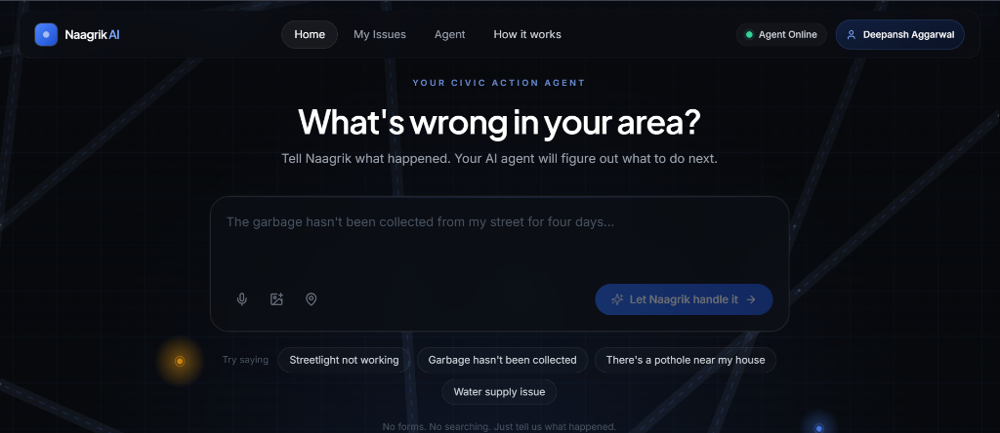
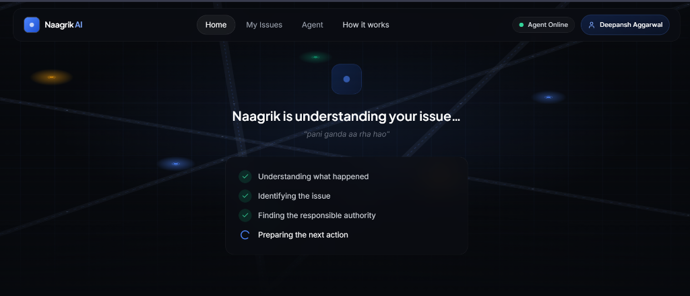
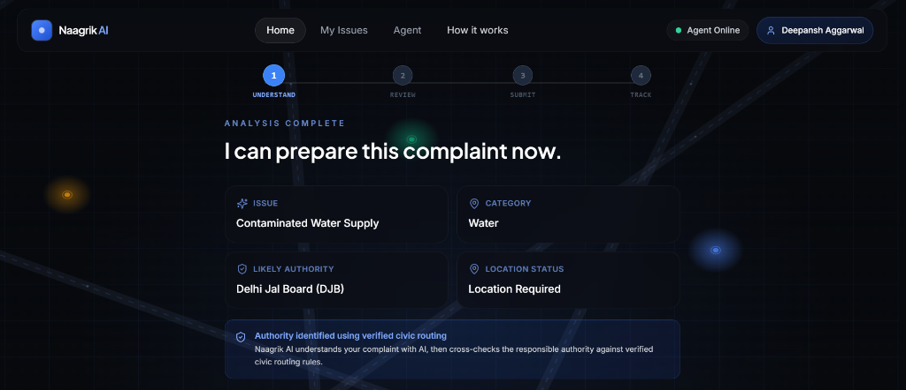
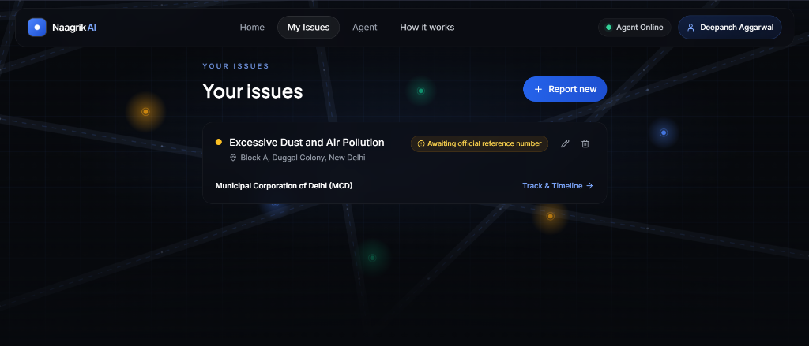
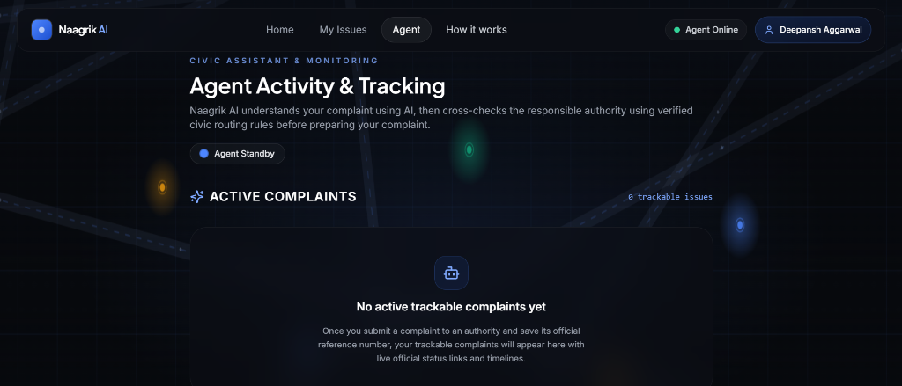
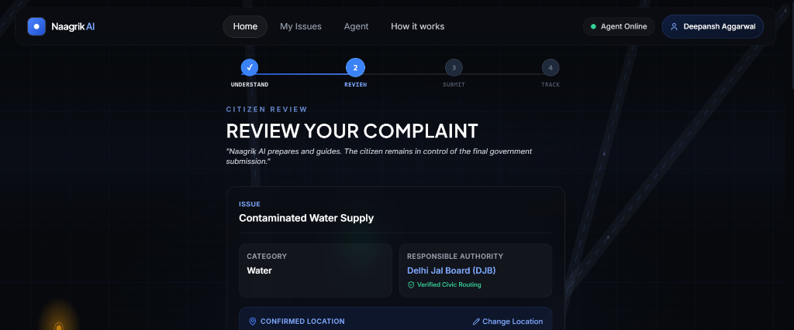
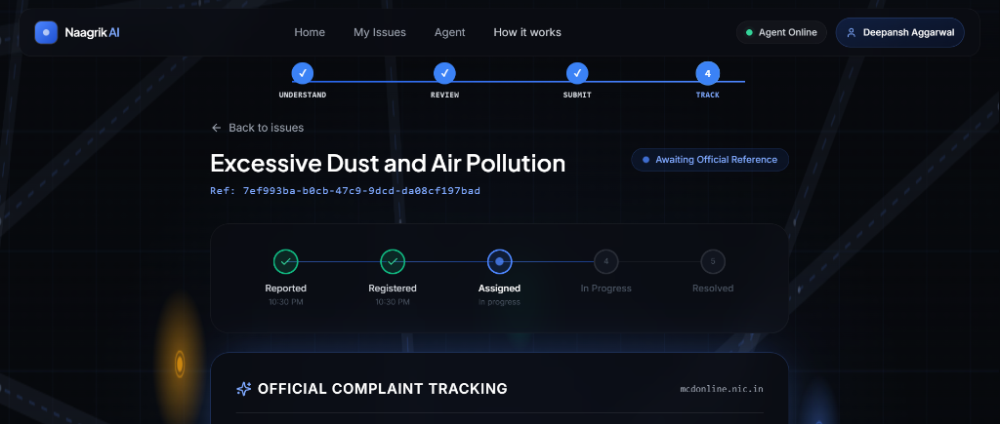
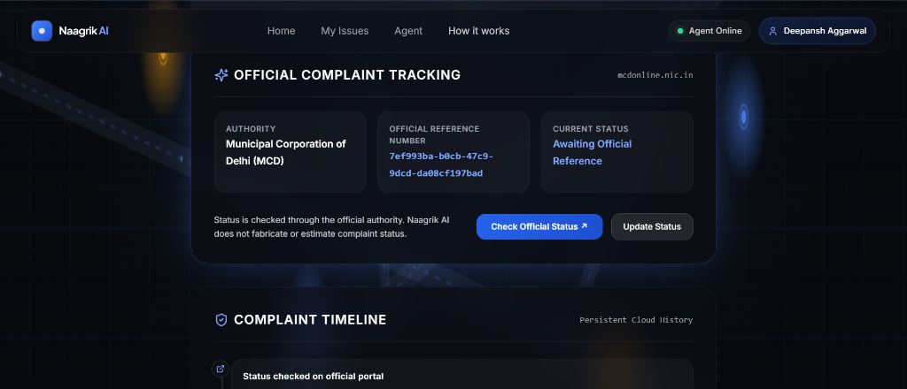

# Naagrik AI — Final Verified Civic Routing & Explainable Authority Layer

**Naagrik AI** is an intelligent civic action assistant designed to bridge the gap between Indian citizens and official municipal grievance portals. It combines **LLM-driven natural language understanding** (Hindi, Hinglish, English, typos, and conversational context) with a **deterministic, rule-based verified civic routing engine** to identify the correct government authority, format formal complaint letters, and manage citizen-controlled status tracking.

---

## 📸 Application Walkthrough & Visual Proof

### 1. Home / Landing Page
The primary citizen portal supporting natural-language conversational input, quick-selection chips, voice input, image attachment, and GPS/manual location selection.



---

### 2. AI Analysis & Processing Sequence
Real-time step-by-step progress feedback while Gemini or Fallback AI parses natural language intent, extracts civic objects, and normalizes the complaint structure.



---

### 3. Issue Analysis & Verified Civic Authority Routing
Deterministic cross-verification screen displaying the extracted issue title, category, responsible authority, location status, and the **Verified Civic Routing** badge explaining authority resolution rules.



---

### 4. My Issues Dashboard
Citizen dashboard listing active civic grievances, reference status badges, location details, and direct access to tracking timelines.



---

### 5. Agent Activity & Monitoring
Central agent interface summarizing active trackable complaints, pending reference numbers, and explaining the dual-layer architecture transparently.



---

### 6. Citizen Review & Formal Complaint Generation
Interactive complaint review interface where citizens verify the AI-extracted details, review the assigned authority (cross-checked via Verified Civic Routing rules), confirm their exact location, and proceed to official submission.



**Demonstrates:**
- Complete citizen control over the drafted grievance before submission.
- Verified authority badge highlighting rule-based mapping (`Delhi Jal Board (DJB)`).
- Location confirmation and modification options to ensure full geographic accuracy.

---

### 7. Complaint Tracking & Persistent Timeline
Comprehensive tracking interface showing the multi-stage progress indicator, saved official reference numbers, citizen-recorded status indicators, and persistent audit timelines.





**Demonstrates:**
- **Visual Progress Bar:** 5-stage civic workflow tracking (`Reported` → `Registered` → `Assigned` → `In Progress` → `Resolved`).
- **Official Reference Linkage:** Displays the citizen-provided reference ID (e.g. `7ef993ba-b0cb-47c9-9dcd-da08cf197bad`).
- **Honest Status Resolution:** Displays accurate statuses like `"Awaiting Official Reference"` or `"Reference Added · Status Not Checked"` without fabricating automatic government updates.
- **Citizen Action Controls:** Direct links to `"Check Official Status"` on official municipal domains (`mcdonline.nic.in`) and `"Update Status"` to log citizen observations.
- **Persistent Cloud Timeline:** Timestamped audit trail of status checks and citizen-recorded updates backed by Supabase storage.

> [!IMPORTANT]
> **Honest Status Guarantee:** Naagrik AI does NOT automatically retrieve or fabricate government status data without an explicit official API integration. Statuses represent actual citizen-recorded checks on official portals.

---

## ⚙️ Core System Architecture

```
                  CITIZEN
                     ↓
            Natural-Language Input
                     ↓
         ┌───────────────────────┐
         │ Gemini / Fallback AI  │
         │ Intent Understanding  │
         └───────────┬───────────┘
                     ↓
             Structured Issue
                     ↓
        ┌─────────────────────────┐
        │ Verified Civic Routing  │ (civicRoutingService.ts)
        │ Deterministic Rules     │ (civicRoutingRules.ts)
        └───────────┬─────────────┘
                    ↓
             Authority + Portal   (authorityPortals.ts)
                    ↓
             Formal Complaint
                    ↓
             Citizen Review
                    ↓
        Official Government Portal
                    ↓
            Official Reference No.
                    ↓
       Citizen-Controlled Tracking
                    ↓
             Persistent Timeline
```

### Architectural Principles
1. **LLM = Language Understanding:** Gemini 3.6 Flash (or `FallbackAIProvider`) parses raw Hindi/Hinglish text, normalizes issues into professional titles, extracts duration facts, and generates formal descriptions.
2. **Deterministic Rules = Authority Routing:** `civicRoutingService.ts` evaluates natural language concepts against `civicRoutingRules.ts`. Verified routing rules **always override** arbitrary LLM authority guesses.
3. **Road Maintenance Ambiguity Safety:** Generic road complaints (e.g. *"gali ki sadak mein gaddhe hain"*) return `needsConfirmation: true` and prompt the citizen to confirm the responsible agency (`PWD`, `MCD`, or `NHAI`) rather than blindly assigning an authority.
4. **Location Preservation:** User-provided address/GPS coordinates are strictly isolated and preserved across all processing steps into the final complaint letter.
5. **Honest Tracking:** No fake government status generation. Status state reflects true citizen action (`"Reference Added · Status Not Checked"`, `"Last checked by you"`, and recorded status updates).

---

## 🏢 Supported Government Authorities

| Authority Key | Responsible Authority | Domain | Coverage Areas |
|---|---|---|---|
| `djb` | Delhi Jal Board (DJB) | `delhijalboard.delhi.gov.in` | Water contamination, pipeline leaks, no water supply, sewer blockages, broken manhole covers |
| `mcd` | Municipal Corporation of Delhi (MCD) | `mcdonline.nic.in` | Sanitation, garbage collection, streetlights, dead animal removal, encroachment, noise pollution |
| `pwd` | Public Works Department (PWD) Delhi | `pwd.delhigovt.nic.in` | PWD arterial roads, flyovers, main road drainage, major potholes |
| `bses` | BSES Yamuna / Rajdhani Power Limited | `bsesdelhi.com` | Power outages, electricity poles, transformers, voltage fluctuations |
| `traffic_police` | Delhi Traffic Police | `traffic.delhipolice.gov.in` | Traffic signals, congestion, road hazards |
| `dda` | Horticulture Department / DDA | `dda.gov.in` | Public parks, park gates, DDA housing infrastructure |
| `nhai` | National Highways Authority of India (NHAI) | `nhai.gov.in` | National Highways (NH-48, NH-24), expressways, toll plazas |

---

## 🛠️ Tech Stack

- **Frontend Core:** React 18, TypeScript, Vite
- **Styling & UI:** TailwindCSS, Lucide Icons, Framer Motion
- **AI Integration:** Google Gemini API (`@google/genai` REST) with fallback to deterministic natural language parsing
- **Backend & Storage:** Supabase (Auth, Database, RLS policies, Timeline tracking)

---

## 🚀 Getting Started

### Prerequisites
- Node.js (v18 or higher)
- npm or yarn

### Installation

```bash
# Clone repository
git clone https://github.com/DEEAGG/Naagrik_AI.git
cd Naagrik_AI

# Install dependencies
npm install
```

### Environment Configuration

Create a `.env` file in the project root:

```env
VITE_GEMINI_API_KEY=your_gemini_api_key_here
VITE_GEMINI_MODEL=gemini-3.6-flash
VITE_SUPABASE_URL=your_supabase_url
VITE_SUPABASE_ANON_KEY=your_supabase_anon_key
```

### Running Locally

```bash
# Start Vite development server
npm run dev
```

### Type Checking & Build Verification

```bash
# Run TypeScript compiler check
npm run typecheck

# Build production distribution
npm run build
```

---

## 📁 Repository Structure

```
Naagrik_AI/
├── docs/
│   └── screenshots/              # Real application screenshots
│       ├── 01-home-landing.png
│       ├── 02-ai-processing.png
│       ├── 03-issue-analysis-routing.png
│       ├── 04-my-issues.png
│       ├── 05-agent-page.png
│       ├── 06-complaint-review.png
│       ├── 07-tracking-timeline.png
│       └── 08-tracking-timeline-detail.png
├── src/
│   ├── components/               # UI views & components
│   │   ├── AnalysisView.tsx
│   │   ├── ComplaintReview.tsx
│   │   ├── ComplaintTrackingCard.tsx
│   │   ├── ComplaintTimeline.tsx
│   │   └── ...
│   ├── data/                     # Civic knowledge base & portals
│   │   ├── civicRoutingRules.ts  # Verified civic routing rules
│   │   └── authorityPortals.ts   # Government portal configurations
│   ├── pages/                    # Application pages
│   │   ├── HomePage.tsx
│   │   ├── AgentPage.tsx
│   │   ├── IssuesPage.tsx
│   │   └── ComplaintTrackingPage.tsx
│   ├── services/                 # Business & routing logic
│   │   ├── civicRoutingService.ts# Deterministic authority resolver
│   │   ├── aiService.ts          # Gemini & Fallback AI pipeline
│   │   ├── complaintService.ts   # Persistence & complaint handling
│   │   └── trackingService.ts    # Timeline tracking engine
│   └── types/                    # TypeScript interfaces
└── package.json
```

---

## 🛡️ License & Disclaimers

Naagrik AI acts as an assistant that formats complaints and guides citizens to official municipal platforms. It does not fabricate government data or claim unauthorized government API access. All official status checks and submissions remain strictly citizen-verified.
